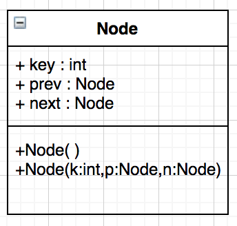

# The role of Unified Modeling Language (UML) class diagram in software documentation

### Introduction

When we build software utilizing a high-level, object-oriented programming language such as Java, not only do we have a vast library (sometimes called an application programming interface or API) at our disposal, we can define our own types as well. The definition of a type in this manner is enabled by a class specification. We can create super class, sub class relationships in which the super class is a "generalization" and the sub classes are "specialization".

### Discussion

Think back to Chris Ward's video on creating documentation. Explore some of the other videos on software documentation. How might the following UML class diagram be represented in the form of a Java class definition? This class diagram can be thought of as a genotype. Your class definition is considered a phenotype.

<p align="center" width="100%">
     
</p>

### References

[Link to Wikipedia entry on software documentation](https://en.wikipedia.org/wiki/Software_documentation)

[Link to Wikipedia entry on genotype](https://en.wikipedia.org/wiki/Genotype)

[Link to Wikipedia entry on phenotype](https://en.wikipedia.org/wiki/Phenotype)

---------------
# Student Answer

I believe this would be an apt presentation of a phenotype example of the provided diagram.

````java
public class Node {
    // Attributes
    private int key;
    private Node prev;
    private Node next;

    // Constructors
    public Node() {
    }

    public Node(int k, Node p, Node n) {
        this.key = k;
        this.prev = p;
        this.next = n;
    }

    // Getter and Setter methods
    public int getKey() {
        return key;
    }

    public void setKey(int key) {
        this.key = key;
    }

    public Node getPrev() {
        return prev;
    }

    public void setPrev(Node prev) {
        this.prev = prev;
    }

    public Node getNext() {
        return next;
    }

    public void setNext(Node next) {
        this.next = next;
    }
}
````
